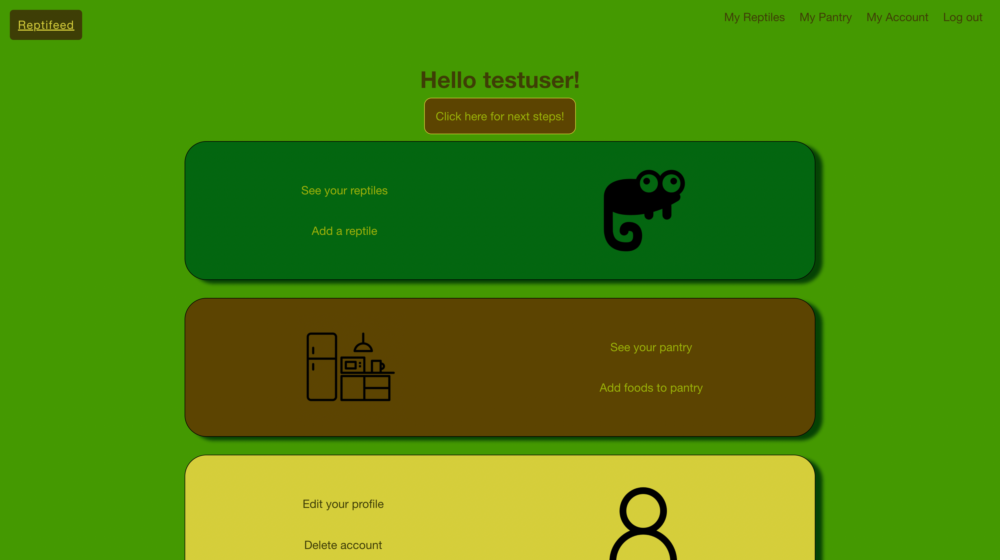

# 🦎 Reptifeed 🦎


#### full stack project by Adam Thometz

[Link to deployment](https://reptifeed.surge.sh/)

## Table of Contents
[I. Info About Repo (high level)](#info-about-repo-high-level)  
[- i. What is Reptifeed?](#what-is-reptifeed)  
[- ii. How Does It Work?](#how-does-it-work)  
[- iii. Where Does The Food Data Come From?](#where-does-the-food-data-come-from)  
[II. Info About Repo (technical details)](#info-about-repo-technical-details)  
[- i. Tech Stack](#tech-stack)  
[- ii. Database Schema](#database-schema)  
[- iii. Authentication Overview](#authentication-overview)  
[- iv. Routing Overview](#routing-overview)  
[- v. Sample User Flow](#sample-user-flow)  
[III. Using This Repo](#using-this-repo)  
[- i. How to run app locally](#how-to-run-app-locally)  
[- ii. How to run tests](#how-to-run-tests)  
[- iii. How to add a reptile food database](#how-to-add-a-reptile-food-database)  
[- iv. How to deploy](#how-to-deploy-the-app) 

## Info about repo (high-level)

### What is Reptifeed?

Reptifeed is an app that is designed to offer suggestions to reptile owners on what to feed their omnivorous pets. A user stores information about their reptiles, fills up a virtual pantry that matches what they have in their kitchen, and gets suggestions on what to feed and how often. The app mixes up suggestions in order to keep reptile diets balanced, a requirement for optimal health as it closely resembles their eating habits in the wild.

### How Does It Work?

When a user makes an account, they are then prompted to add at least one reptile and add some foods that their reptiles eat often to their pantry. They can then feed their reptile based on what's in their pantry. As they feed their pet, users may be prompted to add more foods to their pantry to vary their pet's diet.

The user can learn about the foods they need to feed a balanced diet by checking out the foods page. At the moment, it only works for blue tongue skinks. Learn more in the 'Where Does the Food Data Come From?' section.

The app keeps track of a specific reptile's diet by randomly assigning food based on a frequency pulled from a stack of frequencies*. This stack is kept in localStorage for each reptile and replenishes everytime it runs out.

*`exampleFreqStack = ['occasionally', 'often', 'often', 'moderately', 'often', 'often']`
Stacks for this app can be found in `/frontend/src/utils/foodStack.js`

### Where Does the Food Data Come From?

I got the data for this from two main sources and then pieced them together in `backend/reptifeed-skink-diet.sql`:

- This chart: https://bluetongueskinks.net/foodchart.html
- This page: https://www.lizards101.com/what-can-blue-tongue-skinks-eat-and-not-eat-60-foods/

Truly consistent data on what blue tongue skinks eat was hard to come by, which was one of the reasons I started developing this app. As a new blue tongue skink owner, I was excited but also overwhelmed by the amount of choices regarding what they could eat. I plan to refine the data as I learn more about what skinks eat, perhaps even add in information about nutirition amounts. I also hope to add capabilities for bearded dragons and such in the future!

## Info about Repo (technical details)

### Tech stack

- *Frontend*: React.js, React Router, CSS
- *Backend*: Node.js, Express, SQL, PostgresQL
- *Other*: Jest, Heroku

### Database Schema


### Authentication overview

A user token is required for nearly all routes (listed below). A token could be for users or for admin.

There are two test accounts available on the app when you run locally, one for regular users, and one for admin:

User:
- Username: testuser
- Password: testpassword

Admin:
- Username: testadmin
- Password: adminpassword

Tokens for these accounts can be found in `/backend/reptifeed-schema.sql`

Authentication middleware is located in `/backend/middleware/auth.js`.

### Routing Overview

Routes on the backend are divided into five sections:

1. API routes (this provides access to the food API - login required):
   1. `GET /api/:species/foods`: Get all foods by species. (You can also put a searchTerm into the query section to search for foods)
   2. `GET /api/:species/foods/:food`: Get a specific food for a species.
   3. `GET /api/:species/types/:type`: Get a food group for a species.
   4. `GET /api/:species/treats`: Get treats for a species.
2. Auth routes (authentication routes - no authentication required to access):
   1. `POST /auth/register`: Register for an account.
   2. `POST /auth/login`: Login to your account.
3. User routes (user-related routes - admin or user only):
   1. `POST /users`: Create an account (**not to be confused with the register route above**).**
   2. `GET /users`: Get all users.**
   3. `GET /users/:id`: Get a user.
   4. `PATCH /users/:id`: Edit a user.
   5. `DELETE /users/:id`: Delete a user.
4. Reptile routes (reptile-related routes - admin or owner only):
   1. `POST /reptiles`: Create a new reptile.
   2. `GET /reptiles`: Get all reptiles.**
   3. `GET /reptiles/:id`: Get a specfic reptile.
   4. `GET /reptiles/owner/:id/`: Get all reptiles by owner.
   5. `PATCH /reptiles/:id`: Edit a reptile.
   6. `DELETE /reptiles/:id`: Delete a reptile.
5. Pantry routes (pantry-related routes - admin or owner only):
   1. `GET /pantries/:id`: Get a user's pantry.
   2. `POST /pantries/:id`: Add a food to the user's pantry.
   3. `DELETE /pantries/:id/:food`: Remove a food from the user's pantry.

**Admin only

### Sample User Flow

Log in or register...


...takes you to user profile. What's in next steps?



Things to do to set up! Let's start with adding a reptile! (hint: Clicking on the todo brings you where you need to go)


Let's add our baby!


Success! Can we feed her yet?


Bummer! We need to get some food. Off to the todos!


Well, the todo list is shorter! Let's go add some food!


We're on the food page! You can get food by type or species (blue tongue skink only for now), search for food, and even filter treats


After searching through my real pantry, I found that I have arugula, dog food, mangoes, and calcium and multivitamin supplements, all of which are considered staples of the skink diet, and checked them off.

This is what my pantry looks like now:


NOOWWWW we can feed her!


And we can feed treats too!


You might be reminded to add more food to your pantry. That won't stop you from feeding your pet, since you clearly have the staples at this point. Remember, the point of this app is to help you vary your pet's diet!


Clicking the alert takes you to the todo page. Let's see what we can do!


Back to the food page!


I found some beef, mealworms, bok choy, beets, and basil. They're now in my virtual pantry.


Now I have a varied diet for Unity. Look how happy she is!


## Using this repo

### How to run app locally

**Make sure you have `psql` command available. This app runs on PostgresQL.**

1. Go into the backend driectory and activate the database by running `reptifeed.sql`:

```
cd backend
psql -f reptifeed.sql
```
You should receive a prompt to delete and recreate the 'reptifeed' and the 'reptifeed_test' databases. Agree to both.

2. Activate the API by running `reptifeed-api.sql`

```
psql -f reptifeed-api.sql
```
You should receive a prompt to create the API for both the 'reptifeed' and 'reptifeed_test' databases. Agree to both.

3. Go back up to the root directory and install all necessary dependencies.

```
cd ..
npm install
```

4. Start up the app by typing:

```
npm start
```
The frontend should be running on port 3000 and the backend on port 3001.

### How to run tests

Simple!

#### Root Directory
```
npm test
```

### How to add a reptile food database

1. Create a sql file in the backend directory.
2. In the file, place this code, replacing `REPTILE_NAME` with the name of the reptile in snake case:

```
CREATE TABLE (REPTILE_NAME)_diet (
  name TEXT NOT NULL,
  type TEXT NOT NULL,
  frequency TEXT NOT NULL,
  image TEXT NOT NULL DEFAULT 'https://previews.123rf.com/images/urfandadashov/urfandadashov1805/urfandadashov180500070/100957966-photo-not-available-icon-isolated-on-white-background-vector-illustration.jpg',
  is_treat BOOLEAN NOT NULL,
  tips TEXT
);
```
3. Insert data into the sql file:

```
INSERT INTO (REPTILE_NAME)_diet (name, type, frequency, image, is_treat, tips)
VALUES ...
```

`type` should be either `vegetable`, `protein`, `fruit`, or `supplement`  
`frequency` should be either `often`, `moderately`, or `occasionally`

4. Go into `reptifeed-api.sql` and add the following for both `reptifeed` AND `reptifeed_test` databases

```
DROP TABLE blue_tongue_skink_diet;
DROP TABLE (new table)
\i reptifeed-skink-diet.sql
\i (new file)
```

5. Reactvate API with `psql -f reptifeed-api.sql`

6. Go to `/frontend/src/food/FoodOptions.js` and in the group with the Species label, nest the following into the `<select>` tag:

```
<option value="reptile-name">Reptile Name</option>
```

Make sure that the value attribute is the same as the database name (minus `_diet`) except with dashes (`-`) instead of low dashes (`_`).

*Example: database name = bearded_dragon_diet, value name = 'bearded-dragon'*

### How to deploy the app

The current deployment of this app uses Heroku for backend deployment and Surge for frontend deployment.

#### Backend

Login to your Heroku account and create an app on your account through the CLI

```
cd backend
heroku login
heroku create APP_NAME
```

Make sure you have a file named `Procfile` in this directory with the proper config info for Node.js:
```
web: node server.js
```

Now let's make a Git repo for the backend to push onto the Heroku app:

```
heroku git:remote -a APP_NAME
git add .
git commit -m 'ready to deploy backend'
git push heroku master
```

Go to `APP_NAME.herokuapp.com` to make sure it's up! There's nothing in the index route on the backend so a 404 is expected. Now let's push our databases onto Heroku.

```
heroku addons:create heroku-postgresql:hobby-dev -a APP_NAME
heroku pg:push reptifeed DATABASE_URL -a APP_NAME
heroku config:set PGSSLMODE=no-verify
```

Try registering an account through your API client and you should get back a JSON object with a token and an id.  

The backend has been deployed.

#### Frontend

Let's go to the frontend directory!

```
cd ../frontend
```

If you look at the API in the frontend (`/frontend/src/api.js`), you'll notice the following line at the top:

```
const BASE_URL = process.env.REACT_APP_BASE_URL || 'http://localhost:3001';
```

This is how the frontend and the backend talk to each other. To actually link them in production, type the following in your CLI:

```
REACT_APP_BASE_URL=YOUR_HEROKU_BACKEND_URL npm run build
```

Make sure the URL doesn't end with a slash. Otherwise, backend/API calls won't be formatted correctly and it won't work.  

Now type:

```
cp build/index.html build/200.html
npx surge build
```

You'll be prompted to create a URL.  

Now go check it out!